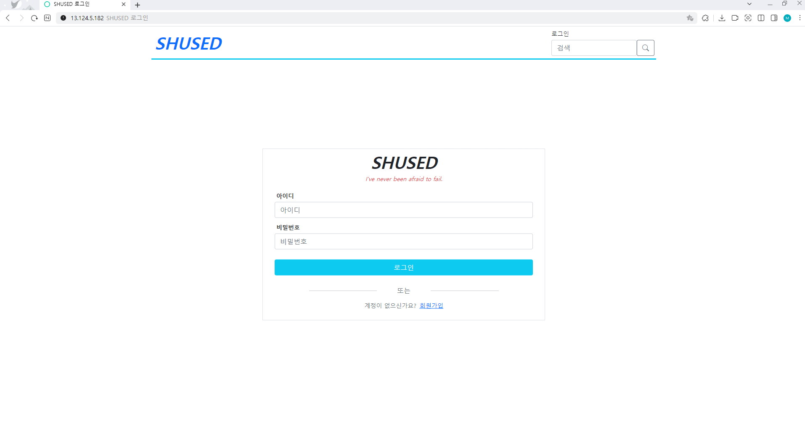
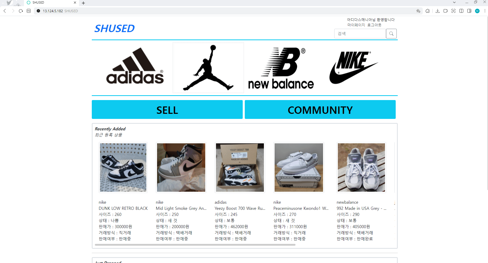
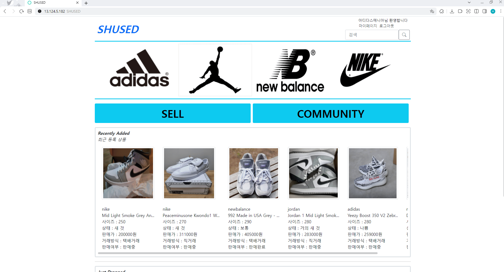
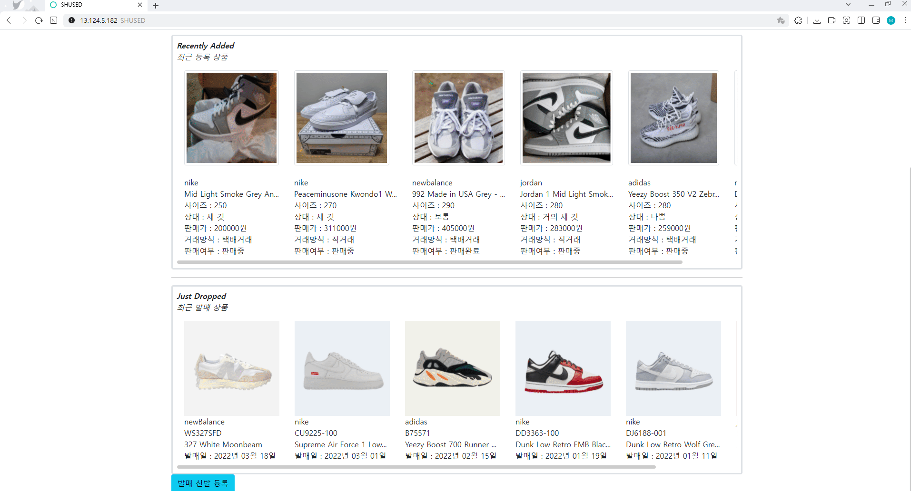
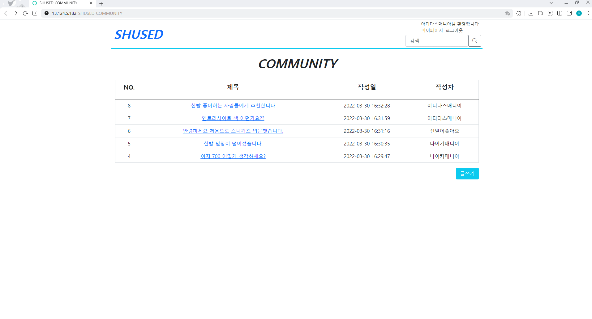

# SHUSED
중고 신발 거래 플랫폼 SHUSED  
http://13.124.5.182:8080/user/signin_view

테스트용 ID : qwer1234  
테스트용 PW : qwer1234

  

## 📢 SHUSED

### 🖼 프로젝트 설명
 * 개인간의 개발 중고 신발 거래 플랫폼 웹 서비스
 * 커뮤니티 기능을 통한 스니커즈 매니아 유저 이용 활성화
 
 ### 👩‍🏫 포트폴리오 
 
 [포트폴리오](portfolio.pdf) 
 
 ### 🛠 설계 🛠
  * UI 기획  
    https://ovenapp.io/project/XiEN57FFegj0XQLQYRhHDWd7ggtBFnfj#njdS5 
    
  * 데이터 베이스, URL 설계  
    https://docs.google.com/spreadsheets/d/1NFhD099JI6MbcS2EKLZwS-jFD-XfsoohzV4FSBPm_98/edit#gid=0  
 
 ### ⛏ 주요기능 ⛏
 * 회원가입
   * package : [com.shused.project.user.*](https://github.com/hoppang98/SHUSED/tree/develop/src/main/java/com/shused/project/user)
   * view : [/webapp/WEB-INF/jsp/user/*](https://github.com/hoppang98/SHUSED/tree/develop/src/main/webapp/WEB-INF/jsp/user)
 * 로그인
   * package : [com.shused.project.user.*](https://github.com/hoppang98/SHUSED/tree/develop/src/main/java/com/shused/project/user)
   * view : [/webapp/WEB-INF/jsp/user/*](https://github.com/hoppang98/SHUSED/tree/develop/src/main/webapp/WEB-INF/jsp/user)
 * 판매 신발 등록, 발매 신발 등록, 신발 검색
   * package : [com.shused.project.shoes.*](https://github.com/hoppang98/SHUSED/tree/develop/src/main/java/com/shused/project/shoes)
   * view : [/webapp/WEB-INF/jsp/shoes/*](https://github.com/hoppang98/SHUSED/tree/develop/src/main/webapp/WEB-INF/jsp/shoes)
 * 커뮤니티(게시글, 댓글, 추천)
   * package : [com.shused.project.community.*](https://github.com/hoppang98/SHUSED/tree/develop/src/main/java/com/shused/project/community)
   * view : [/webapp/WEB-INF/jsp/community/*](https://github.com/hoppang98/SHUSED/tree/develop/src/main/webapp/WEB-INF/jsp/community)

### 🎆 데모 🎆

 💎 회원 가입
 
 
 
 💎 로그인
 
 
 
 💎 로그아웃
 
 
 
 

 
 💎 메인 페이지 및 신발 판매
 
 
 
 💎 신발 상세보기 및 판매완료 처리
 
 
 
 💎 신발 삭제
 
 
 
 💎 신발 구매 및 다른 계정 신발 삭제 시도
 
 

 💎 신발 검색
 
 
 
 💎 발매 신발 정보 등록
 
 
 
 

 
 💎 커뮤니티
 
 
 
 💎 커뮤니티 게시글, 댓글, 추천 등록
 
 
 
 💎 마이페이지
 
 
 
### ✏ 외부 라이브러리 라이센스 ✏ 

* Tomcat [Apache License 2.0](https://www.apache.org/licenses/LICENSE-2.0) 
* Mysql [GPLv2 or proprietary](https://www.gnu.org/licenses/gpl-3.0.html)
* Spring framework [Apache License 2.0](https://www.apache.org/licenses/LICENSE-2.0)  
* Mybatis [Apache License 2.0](https://www.apache.org/licenses/LICENSE-2.0)
* Bootstrap [MIT License](https://opensource.org/licenses/MIT)
* jQuery [MIT License](https://opensource.org/licenses/MIT)
* 이미지 출처 : [pixabay](https://pixabay.com/ko/)

### 🎁 향후 계획
 * 북마크 기능 추가
 * 유저별 친구맺기 기능 추가
 * 신발 위치별 사진 올리는 기능 추가
